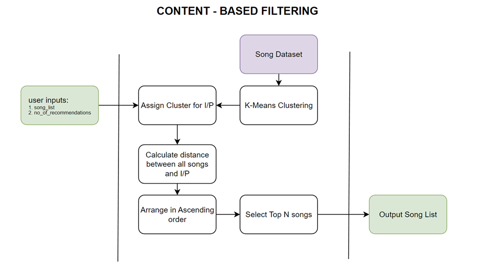
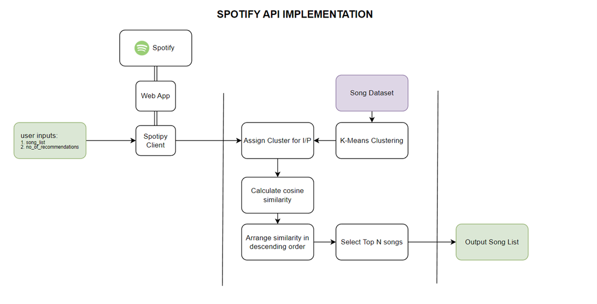
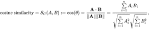

# Spotify Recommendation System

This project is a demonstration of a content-based recommendation system for Spotify that leverages user's preferences and audio features to generate personalized song recommendations.

## Introduction
A music recommendation system is a system that uses various techniques to suggest songs or pieces of music to users. The goal of such a system is to personalize the music listening experience for each user, by providing them with a list of songs that they are likely to enjoy based on their listening history, preferences, and other factors. Music recommendation systems have become increasingly popular in recent years, with the rise of streaming services such as Spotify, Apple Music, and Pandora. These services use recommendation systems to help users discover new music and to keep them engaged with the platform.

## Problem Definition
There are several challenges in developing a music recommendation system. One of the main challenges is dealing with the large amount of data available. At the same time, there are certain challenges which we want to address with this project. To work on these problems, we will start out by collecting data from Spotify API or a Kaggle dataset. Then we will clean and analyze the data to find insights to better understand the relationship between every variable. Later we will munge the data and apply normalization, encoding preprocessing. Once data is prepared, we aim to try a bunch of models and techniques like collaborative filtering, content filtering, pairwise ranking etc. to find the best model which can recommend songs based on historical data. After defining threshold and retrieving results, we plan to create visualizations which support our output and help convey good recommendations to user.

## Data Sources
Our main goal is to integrate this project with Spotify API. However, in the initial stages we will be using a dataset publicly available on [Kaggle](https://www.kaggle.com/datasets/vatsalmavani/spotify-dataset).

## Recommender System Design
Recommender systems are a class of machine learning algorithms that suggest items or products to users based on their preferences and past behavior. The goal of these systems is to provide personalized recommendations to users, improving their overall experience and increasing engagement. There are several types of recommender systems, each with its unique features and limitations.

---

### Content-based Recommenders: 
These systems recommend items that are similar to those a user has already liked in the past. The system analyzes the characteristics of the items that the user has interacted with, such as the genre of a movie, the author of a book, or the style of clothing, and suggests items with similar attributes.
### Collaborative Filtering Recommenders:
These systems recommend items based on the preferences of similar users. The system analyzes the user's past behavior and finds other users with similar tastes. It then recommends items that these similar users have interacted with but the target user has not yet.

---

Since we don’t have user ratings for tracks available in our dataset, we will use Content-based Filtering. The idea is that a user will enter a list of tracks as input to our recommender system. Our system will then try to associate the songs with other songs in our data which closely match its attributes. For example, if your input contains Pop songs, it’s highly likely our model will recommend a pop song which has high association with the input tracks. 
But how do we actually build associations between tracks and recommend songs?

1.	We will first utilize a clustering algorithm on our entire song dataset.
2.	Each cluster output resembles a set of songs which share similar traits.
3.	Once a user enters a song, the system will compare its attributes and assign it a cluster. 
4.	After assigning the cluster, the system will then check distance between the input song and all songs in that cluster and arrange them in an ascending order. There are multiple methods which can be used to perform this task. We will be utilizing ‘mean vectors’ and ‘cosine similarity’ for this project.
5.	Depending on how many recommendations a user wants, let’s call it ‘n’, the system can output top n recommendations based on the request.

However, it's worth noting that content-based filtering can also suffer from the "more of the same" problem, where users receive recommendations that are too similar to their past behavior or preferences. This can be fixed by utilizing hybrid approach but that is out of scope for our project due to unavailability of data points, due to privacy concerns from Spotify’s end.

# Implementation
Now that we have designed our Recommender System, we need to implement it in a way that it relates with the dataset that we have in hand. Our first roadblock is to streamline the ‘song lookup’ process. For example, If a user provides an input “seven nation army”, then the recommender system has to process the string and understand that the user is referring to the song “Seven Nation Army – The White Stripes”. 
To ensure that our song lookup works, we used a library called ‘spotipy’. Spotipy, when provided with access credentials to Spotify API, opens a plethora of options to access functions and data provided by Spotify. We first created our developer account on Spotify and applied for a developer access to their API through OAuth2. 
Once we have the necessary credentials, we used spotipy’s inbuilt functions to access and search songs and their features so that we can feed it as an input to our recommender system.

Once we have the necessary input data provided by Spotify API, we move on to assigning cluster, calculating mean vectors for our existing dataset songs and lastly calculating cosine similarity. Cosine similarity is a commonly used measure of similarity between two non-zero vectors. It measures the cosine of the angle between the two vectors in a multi-dimensional space, where the value ranges from -1 (for opposite directions) to 1 (for the same direction).

In other words, it is a measurement of how similar two vectors are in terms of their orientation. The closer the cosine similarity value is to 1, the more similar the vectors are, and the closer it is to -1, the more dissimilar they are. A value of 0 indicates that the vectors are orthogonal (perpendicular) to each other.

